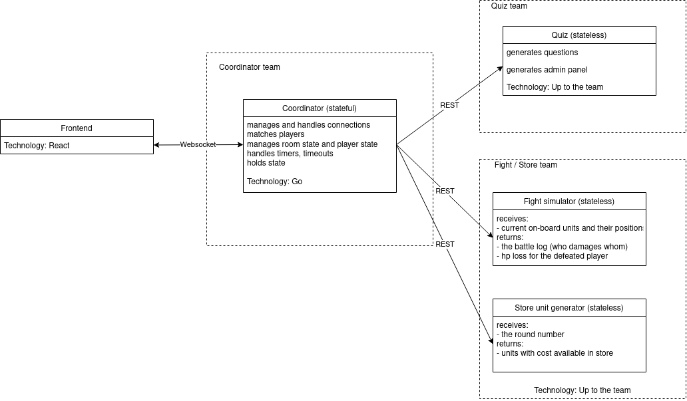

# AGHtochess


Live deployment at [https://aghtochess.mionskowski.pl/](https://aghtochess.mionskowski.pl/)

## Local deployment

In order to deploy the application locally run:

```bash
docker-compose up -d --build
```

and navigate to `localhost:8080`


## Questions

The file with questions is located at `communicator/assets/questions.json`.
You can modify its content to change the questions present in the game
(make sure there is at least one question of each difficulty).

### Manual generation

There is a script for generating new questions.
```
scripts/generate_questions.py
```
It will lead you through generating questions, then you can just paste the geneated json
into the `communicator/assets/questions.json` file.

### Generation from a PDS/Drill file

There is also a script for generating question files from a PDS / Drill format.
```
scripts/drill2questions.py drill-file [start-id]
```

It will output a json string compatible with `communicator/assets/questions.json` file.

## Architecture



---

## Remote deployment

Navigate to `docker-compose.yml.production` and adjust environment variables to suit the environment.

SSL certificate is required for websocket connections. The deployment script supports the use of [Let's encrypt nginx companion proxy](https://github.com/nginx-proxy/docker-letsencrypt-nginx-proxy-companion) to handle that matter.

Automatic port forwarding can be enabled using [nginx-auto-proxy](https://github.com/nginx-proxy/nginx-proxy).

On the remote environment run:

```bash
docker-compose -c docker-compose.yml.production up -d --build
```

## Development

- [Communication protocol](https://github.com/zemiret/AGHtochess/wiki/Communication-protocol)

## The team

* Antoni Mleczko - [zemiret](https://github.com/zemiret)
* Grzegorz Wcisło - [grzegorz-wcislo](https://github.com/grzegorz-wcislo)
* Tomasz Zawadzki - [tomekzaw](https://github.com/tomekzaw)
* Mateusz Hurbol - [matix522](https://github.com/matix522)
* Mateusz Naróg - [narogm](https://github.com/narogm)
* Arkadiusz Kraus - [arkadiuss](https://github.com/arkadiuss)
* Maciej Mionskowski - [maciekmm](https://github.com/maciekmm)
* Piotr Matląg - [matlagp](https://github.com/matlagp)
